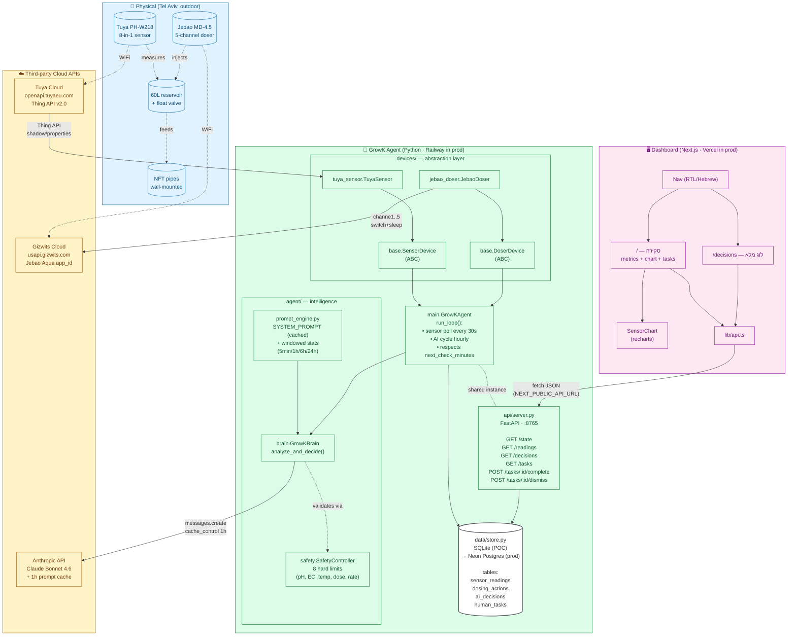
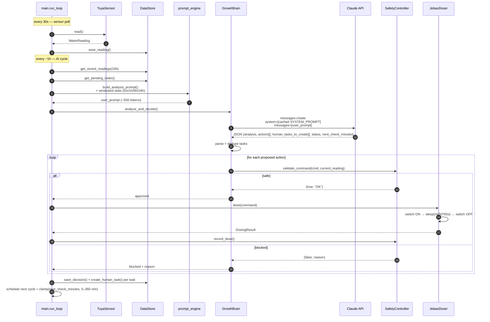
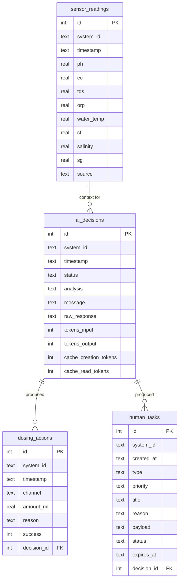
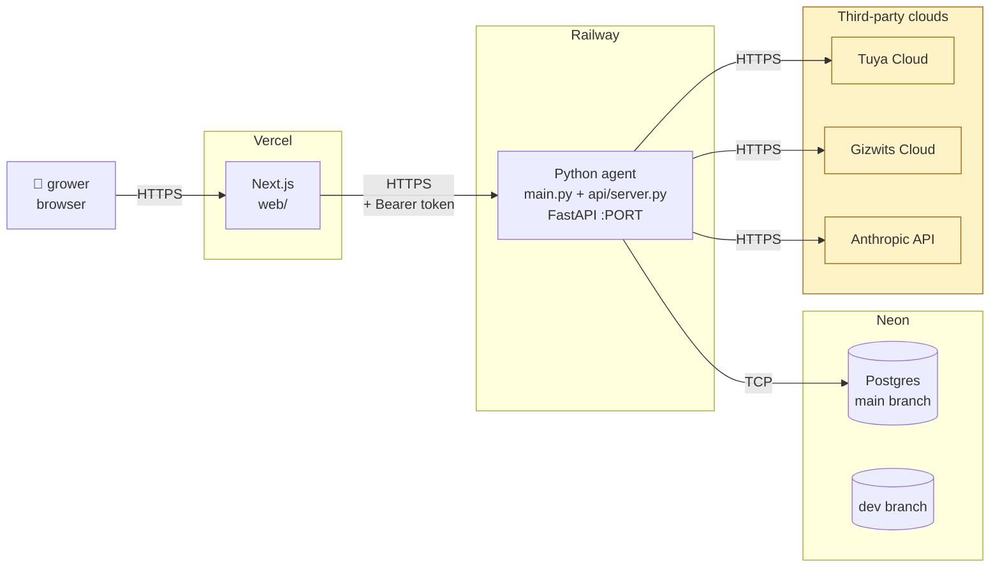

# GrowK — Architecture

מסמך תיעוד הארכיטקטורה. עודכן 2026-05-07.

## 1. תרשים מערכת (Mermaid)



## 2. מחזור החלטה (Sequence)



## 3. הארכיטקטורה ב-4 שכבות

| # | שכבה | אחריות | מודולים |
|---|---|---|---|
| 1 | **Hardware abstraction** | מסך כל חיישן/אקטואטור מאחורי ABCs. אפשר להחליף Tuya ל-Atlas Scientific מבלי לגעת בלוגיקה. | `devices/base.py`, `devices/tuya_sensor.py`, `devices/jebao_doser.py` |
| 2 | **Safety** | gate אחרון לפני כל פעולה פיזית. גבולות קשיחים שה-AI לא יכול לעקוף. רץ מקומית, אין צורך באינטרנט. | `agent/safety.py` (`SafetyController`, `SafetyLimits`) |
| 3 | **AI Brain** | בונה prompt עשיר עם חלונות סטטיסטיים, שולח ל-Claude (cached), מפענח JSON, מעביר דרך safety, יוצר Human Tasks עם dedup. | `agent/brain.py`, `agent/prompt_engine.py` |
| 4 | **UI / API** | חשיפה ל-grower: dashboard עברית, גרפים, היסטוריה, אישור משימות. | `api/server.py` (FastAPI) + `web/` (Next.js + recharts) |

**+ Human Task Queue (חוצה שכבות):** האייג'נט יוצר tasks עבור המשתמש כשפעולה נדרשת מחוץ ליכולת שלו (החלפת מים, אישור מינון, ריסט, שאלות, פעולה ידנית). Dedup ב-brain, persistence ב-store, חשיפה ב-UI.

## 4. מודל הנתונים



`system_id` נמצא בכל טבלה מההתחלה — מאפשר הרחבה ל-3+ מערכות בלי מיגרציה.

## 5. תזרים מידע — תרחישי ליבה

### תרחיש: קריאת חיישן רגילה (כל 30 שניות)
```
Sensor → Tuya Cloud → tuya_sensor.read() → WaterReading → store.save_reading()
```
תוצאה: שורה חדשה ב-`sensor_readings`. UI מציג עדכון בכרטיסים תוך 5 שניות (interval של ה-dashboard).

### תרחיש: מחזור החלטה (כל ~1 שעה)
```
loop → store.get_recent_readings(24h)
     → prompt_engine.build_metric_table() → windowed stats
     → brain.analyze_and_decide()
     → Claude API (cache hit ~80% מהזמן)
     → JSON {actions, human_tasks_to_create, status, next_check_minutes}
     → safety.validate_command() per action (filter)
     → doser.dose(approved)
     → store.save_decision() + save_action() + create_human_task()
```
תוצאה: ai_decisions row, אולי dosing_actions, אולי human_tasks. UI מציג message חדש ב-dashboard, decision חדש ב-`/decisions`.

### תרחיש: השלמת משימה אנושית
```
UI button → POST /api/tasks/:id/complete → store.complete_task() → status='done'
```
המחזור הבא של ה-AI יראה שהמשימה לא pending — לא יווצר duplicate.

## 6. Deployment topology (מתוכנן)



**Network boundaries:**
- Browser ↔ Vercel: HTTPS
- Vercel ↔ Railway: HTTPS + bearer token (`GROWK_API_TOKEN`)
- Railway ↔ Neon: TCP/SSL via `DATABASE_URL`
- Railway ↔ third-party clouds: outbound HTTPS

## 7. עקרונות מפתח

1. **Plug-and-play hardware:** brain אינו יודע על Tuya/Jebao. החלפת מכשיר = שינוי קובץ אחד תחת `devices/`.
2. **Safety isolated from intelligence:** AI מציע, Safety אוכף. גם אם Claude נופל ב-API שגוי, שכבת ה-safety מקומית וחוסמת.
3. **Decisions are observational, not reactive:** דגימה כל 30s, החלטה כל ~1h. cross-window agreement נדרש לפעולה.
4. **Cache-aware prompt design:** SYSTEM_PROMPT (~3.7K tokens) cached 1h TTL → ~10× חיסכון בעלות בקריאות חוזרות.
5. **Human-in-the-loop optional, not blocking:** האייג'נט אוטונומי. Tasks למשתמש רק כשנדרש (החלפת מים, אישור חריג, ריסט, שאלת הבהרה).
6. **Multi-system ready by design:** `system_id` בכל שורת DB מההתחלה.
